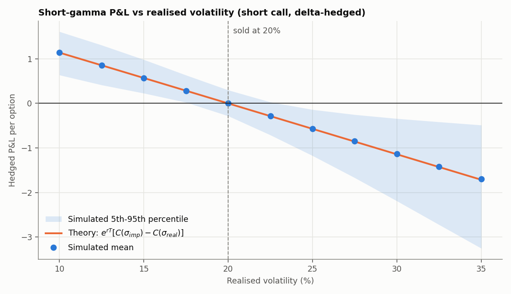
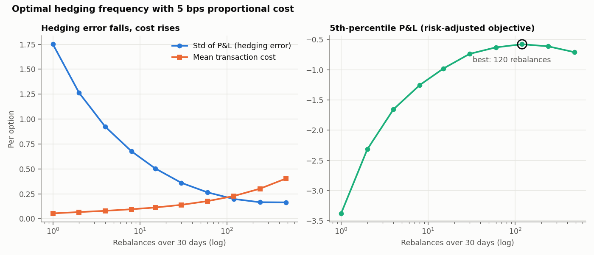
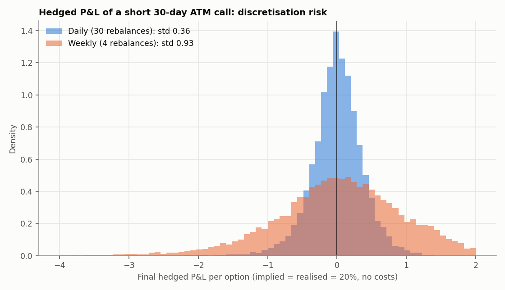
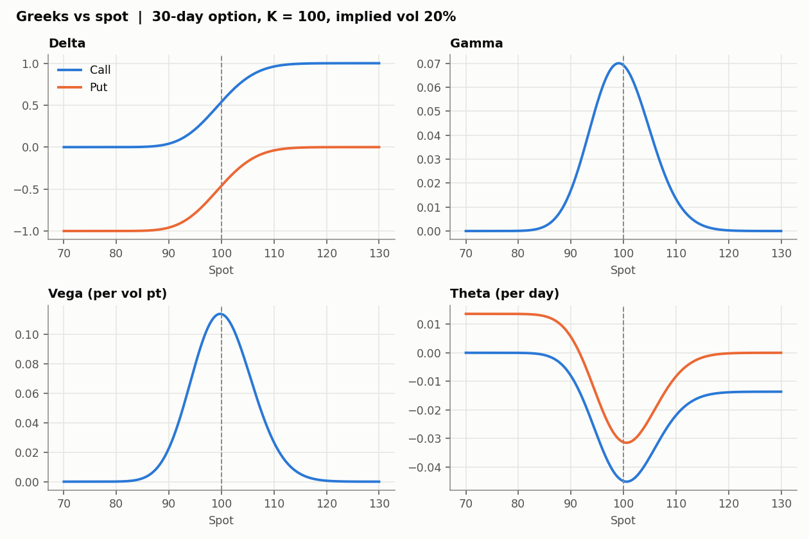
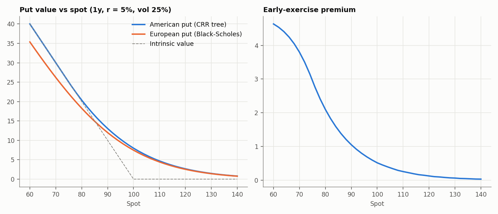

# Options Pricing, Greeks and Delta-Hedging Simulator

Black-Scholes-Merton pricer with analytic Greeks and implied volatility, a
Cox-Ross-Rubinstein tree for American options, and a Monte Carlo
simulator of a dealer who sells an option and delta-hedges it at
discrete times with transaction costs.

## Questions it answers

1. **What does a short, delta-hedged option earn when realised volatility
   differs from the implied volatility it was sold at?**
2. **How does hedging error shrink with rebalancing frequency, and where is
   the optimal frequency once every rebalance costs money?**
3. **How much is the right to exercise early worth?**

## Results

### Realised vs implied volatility



With the hedge ratio computed at implied vol and the stock drifting at
the risk-free rate, the expected hedged P&L of a short option is

$$E[\text{P\&L}] = e^{rT}\,\big(C(\sigma_{imp}) - C(\sigma_{real})\big)$$

The simulated means (dots, 6,000 paths each) sit on this curve across
realised vol from 10% to 35%. Selling a 30-day ATM call at 20% implied
earns about +1.14 per option if it realises at 10% and loses about
−1.14 if it realises at 30%. `test_hedge_mean_pnl_matches_theory` checks
this to within 4 standard errors. Calls and puts give identical hedged P&L,
as put-call parity requires.

### Hedging frequency and transaction costs



| Rebalances in 30 days | Std of P&L | Mean cost (5 bps) | 5th percentile P&L |
|---:|---:|---:|---:|
| 1 | 1.75 | 0.05 | −3.38 |
| 4 | 0.92 | 0.08 | −1.65 |
| 30 (daily) | 0.36 | 0.14 | −0.74 |
| **120** | **0.20** | **0.23** | **−0.58** |
| 480 | 0.16 | 0.40 | −0.71 |

Hedging error falls roughly as 1/√n (each 4× increase in frequency about
halves it), while cost grows with the number of trades. Optimising the
5th-percentile P&L gives an interior optimum of about 120 rebalances,
i.e. four times a day, for this option and cost level.



### Greeks and American exercise




Gamma and vega peak at the money, and theta is most negative there. The
tree's European price converges to Black-Scholes, and the early-exercise
premium of a put grows as it moves in the money. An American call on a
non-dividend stock has zero premium; with a large dividend yield it has a
positive one. Both cases are tested.

## Validation (`tests/test_options.py`, 9 tests)

- Textbook values: S = K = 100, T = 1, r = 5%, σ = 20% → call 10.4506, delta 0.6368, put 5.5735
- Put-call parity with dividends, to 1e-10
- Every analytic Greek (delta, gamma, vega, theta, rho; calls and puts) matches central finite differences
- Implied vol round-trips for 5%, 20% and 80% vol
- Binomial tree converges to Black-Scholes; American exercise rules
- Simulated hedge P&L matches the closed form above
- Hedging error ratio for 4× frequency lies within 0.35–0.65 (theory: 0.5)
- Costs create an interior optimum

## Layout

```
src/black_scholes.py     pricing, Greeks, implied vol (vectorised)
src/binomial.py          CRR tree, European and American
src/delta_hedge_sim.py   GBM paths, discrete hedging with costs, frequency study
src/generate_plots.py    all figures
tests/test_options.py
```

## Run

```bash
pip install -r requirements.txt
python src/black_scholes.py        # textbook check
python src/delta_hedge_sim.py      # frequency study table
python src/generate_plots.py       # all figures
pytest -q                          # or: python ../run_tests.py 01
```

## Assumptions and limits

- Constant volatility and rates, GBM paths, no jumps. Real hedging P&L
  also depends on the path of gamma exposure (gamma-weighted realised
  variance) and on volatility changes, which this model does not have.
- Costs are proportional to traded notional. Real costs also include
  spread-crossing and market impact.
- Natural extensions: stochastic volatility (Heston) paths, hedging with
  a volatility surface, and vega-hedging with a second option.
