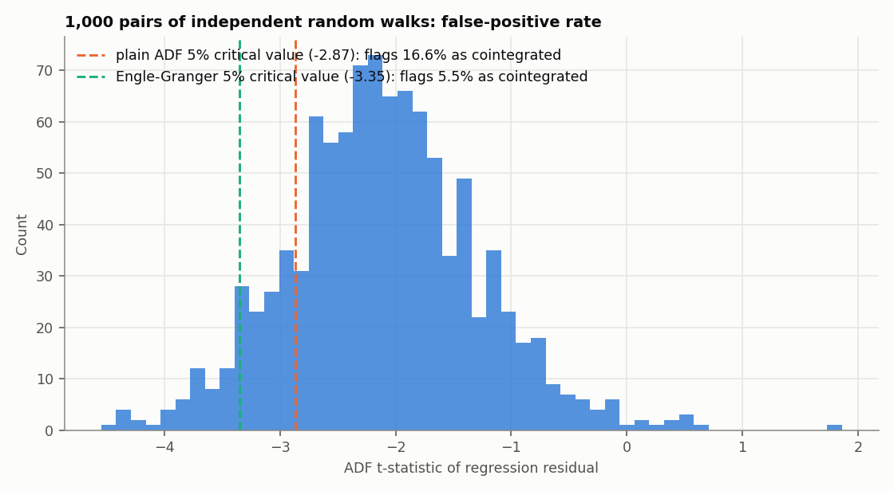
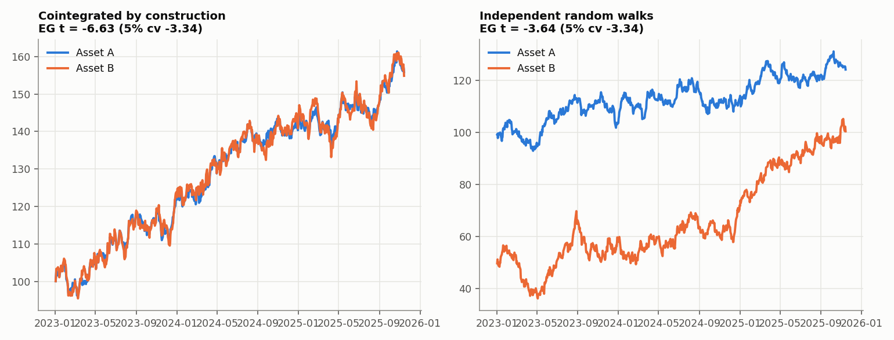
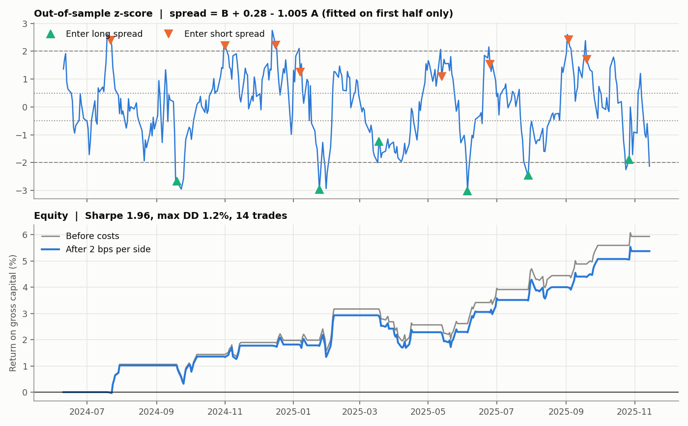
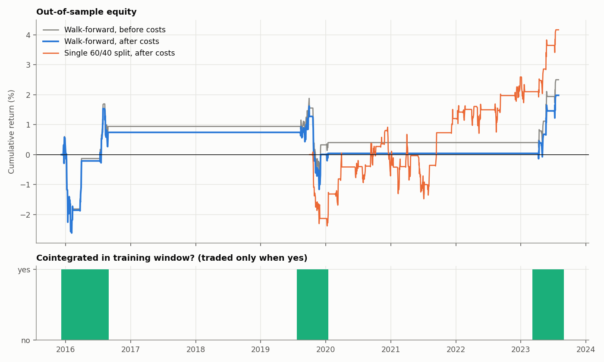
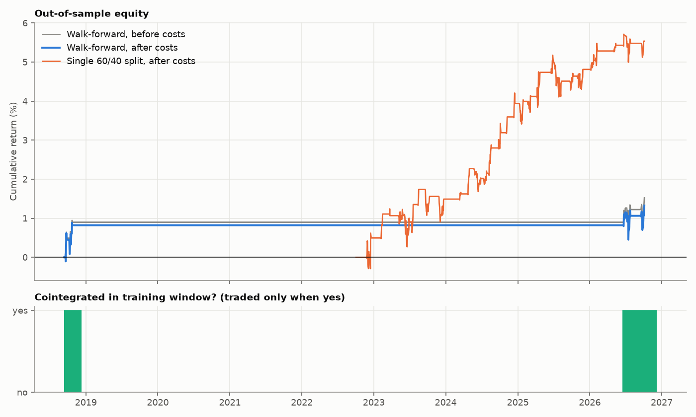

# Pairs Trading / Statistical Arbitrage

A cointegration test written from scratch, a pairs backtest engine with
correct accounting, and a walk-forward research protocol that re-screens
and re-fits every quarter using only past data. It runs on Yahoo Finance
data, any CSV of prices, or simulated data.

## Components

| File | Purpose |
|---|---|
| `src/cointegration.py` | OLS hedge ratio, ADF test with AIC lag selection, MacKinnon (2010) finite-sample critical values for both plain ADF and Engle-Granger residuals, mean-reversion half-life |
| `src/engine.py` | Backtest engine: z-score entry/exit/stop, next-close execution, hedge-ratio-consistent sizing (any sign of beta), costs on every entry and exit |
| `src/research.py` | Walk-forward screen → fit → trade loop, single 60/40 split, cost sensitivity, parameter grid, markdown summary |
| `src/plot_research.py` | Figures for a research run |
| `src/generate_plots.py` | Figures for the synthetic validation |

## 1. The statistical test is calibrated

The residual from a fitted regression looks more stationary than it is,
so ordinary ADF critical values are wrong for cointegration testing.
1,000 pairs of independent random walks (500 observations each):



| Critical value used | Pairs flagged "cointegrated" (should be 5%) |
|---|---:|
| Plain ADF, 5% (−2.87) | **16.6%** |
| Engle-Granger, 5% (−3.35) | **5.5%** |

The unit tests repeat this size check for both the ADF and Engle-Granger
tests and also check power: AR(1) series with φ = 0.9 are rejected more
than 90% of the time.

A calibrated test is still wrong 1 time in 20. The demo pair of
independent random walks below happens to be one of those false
positives (t = −3.64). That is why the walk-forward protocol requires
the relationship to hold in each new training window, and why a
universe screen uses the 1% level.



## 2. The engine's accounting is tested



On a pair that is cointegrated by construction (hedge ratio fitted on the
first half, traded on the second): Sharpe 1.96, 14 trades, 5.4% net
return on gross capital, 1.2% max drawdown, costs of 2 bps per side
included.

Properties covered by `tests/test_pairs.py` (13 tests):

- **P&L identity.** Daily gross P&L equals held units × change in spread, exactly.
- **Reconciliation.** Summed per-trade net P&L equals summed daily net P&L,
  including entry and exit costs.
- **Negative hedge ratios.** A pair with β < 0 is held as long/long or
  short/short and remains profitable.
- **No look-ahead.** Changing prices after day t does not change any signal
  or position up to day t.
- **Execution lag.** A signal at close t is filled at close t+1.
- **Stop-loss.** A stop exits the trade and blocks re-entry until the spread
  normalises.
- **Walk-forward protocol.** It trades only after the training window, and
  never trades a pair that failed its screen.

## 3. Walk-forward protocol

```
for each quarter (63 trading days):
    training window = previous 504 days (2 years)
    for each candidate pair: Engle-Granger test on the training window
    trade only pairs that pass (5% for one pair, 1% when screening many)
    alpha, beta fitted on the training window, frozen for the quarter
    rolling z-score (lookback 30) -> enter |z| > 2, exit |z| < 0.5, stop |z| > 4
    positions closed at quarter end
```

It also reports a single chronological 60/40 split, cost sensitivity
(0–10 bps) and a lookback × entry-threshold grid as robustness diagnostics.
The grid is not used to pick parameters.

`results/synthetic/` contains a complete run on simulated prices whose
cointegration switches on and off every 500 days (`python src/research.py
--synthetic`). It shows the output format and the regime gating:



## 4. Results on real FX data

Data: daily Federal Reserve (H.10) exchange rates, `data/fx_daily_fred.csv`
(source and conversion in `data/SOURCES.md`). Default settings, 2 bps per
side, next-close execution. Full tables are in `results/<run>/summary.md`.

| Run | Period | Quarters where the screen passed | Trades | Net return | Sharpe | t-stat |
|---|---|---:|---:|---:|---:|---:|
| EURUSD / GBPUSD | 2016–2026 | 6% | 3 | −0.4% | −0.20 | −0.58 |
| AUDUSD / NZDUSD | 2016–2026 | 3% | 1 | +0.6% | 0.41 | 1.21 |
| 5-currency universe (10 pairs, 1% level) | 2016–2026 | 11% | 8 | −1.8% | −0.18 | −0.53 |
| EURUSD / GBPUSD, 5-year training window, 60-day lookback | 2006–2026 | 13% | 13 | +2.1% | 0.21 | 0.85 |

**Conclusion: there is no evidence of a tradable edge in daily pairs trading on major FX pairs.**

- **The relationship rarely holds.** Major FX pairs pass the cointegration
  screen in only 3–13% of quarters, so the walk-forward strategy correctly
  stays flat most of the time. Over the longer 2006–2026 run it made 13
  trades and none of the t-statistics comes close to 2.
- **The one-shot split looks better, and that is the trap.** EURUSD/GBPUSD
  passes the test over 2016–2022 (t = −4.14) with a mean-reversion
  half-life of about 50 trading days. Trading 2022–2026 on those frozen
  parameters gives +3.2% (Sharpe 0.38). The walk-forward protocol shows the
  relationship was not stable enough to identify in real time.
- **The windows were too short.** A 50-day half-life in a 504-day window
  gives the test about 10 half-lives of data, which is too little power.
  That is why the fourth run uses a 5-year window and a 60-day lookback.
  The settings were chosen from the training half-life, not by searching
  over test results. It still finds no significant edge.



## Running on other data

```bash
pip install -r requirements.txt
cd src
python research.py --csv ../data/fx_daily_fred.csv --cols EURUSD GBPUSD --start 2016-01-01
python research.py                               # Yahoo Finance: EURUSD=X vs GBPUSD=X
python research.py --tickers EWA EWC             # Australia vs Canada ETFs
python research.py --tickers KO PEP
python research.py --tickers EWA EWC EWU EWG EWQ # universe screen, 10 pairs, 1% level
python research.py --csv my_prices.csv           # date index + one column per asset
```

Each run writes `results/<name>/summary.md` (metrics table, cost
sensitivity, parameter grid), the CSVs behind it, and three figures.

## Assumptions and limits

- Daily closes. Fills at the next close, with costs as a flat bps rate on
  notional; no bid/ask spread model or market impact.
- Yahoo Finance data is adequate for research, not for execution.
  Adjusted prices, FX quotes and ETF closes are not synchronised to the
  same second.
- The hedge ratio is fixed within each quarter. A Kalman-filter hedge
  ratio is the natural next step.
- No borrow costs or funding for the short leg.
- With few pairs and few years, the t-stat reported next to the Sharpe
  ratio is the honest measure of whether the result is distinguishable
  from zero.
