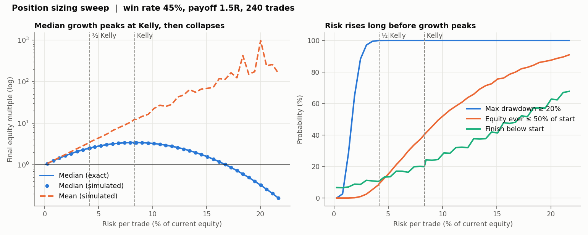
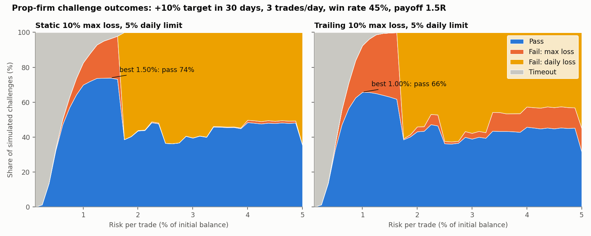
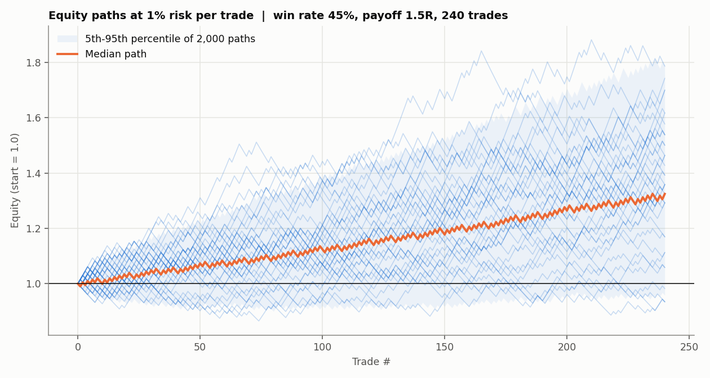

# Position Sizing, Risk of Ruin and Prop-Firm Challenge Simulator

Monte Carlo study of fixed-fractional position sizing, checked against
closed-form Kelly results, plus a simulator of a prop-firm evaluation
with profit target, maximum-loss and daily-loss rules.

Base case throughout: **45% win rate, 1.5R average win, 1R loss**, which
gives an expectancy of +0.125R per trade and a full Kelly fraction of **8.33%**.
The R-distribution can instead be bootstrapped from a real trade journal
(`empirical_r=`), for example the output of project 4.

## 1. Growth vs risk, past full Kelly



Results over 240 trades (about a year at one trade per day), 10,000 paths per size:

| Risk per trade | Median final equity | P(max DD ≥ 20%) | P(equity ever ≤ 50%) | P(finish below start) |
|---:|---:|---:|---:|---:|
| 0.5% | 1.16× | 0% | 0% | 7% |
| 1% | 1.33× | 10% | 0% | 7% |
| 2% | 1.69× | 71% | 0.2% | 9% |
| 4.2% (½ Kelly) | 2.53× | 100% | 9% | 11% |
| **8.3% (Kelly)** | **3.44×** (peak) | 100% | 40% | 20% |
| 16.7% (2× Kelly) | 1.03× | 100% | 80% | 48% |
| 20.8% (2.5× Kelly) | 0.23× | 100% | 90% | 63% |

- **Median growth peaks exactly at Kelly and falls to zero at about 2× Kelly.**
  At 2.5× Kelly the typical account loses 77%, even though every trade
  has positive expectancy.
- **The mean is useless here.** It keeps rising, to 677× at 2.5× Kelly,
  because a handful of extreme paths dominate. A single account
  experiences the median, not the mean.
- **Drawdown risk arrives long before growth peaks.** At only 2% risk,
  71% of accounts see a 20% drawdown. Half Kelly gives up about a quarter
  of the peak median growth (2.53× vs 3.44×) and cuts P(hit 50%) from 40%
  to 9%, which is why practitioners size at a fraction of Kelly.

**Closed-form check.** In the binary model, final equity increases with
the number of wins, so the median final equity is exactly
(1 + b·f)^k · (1 − f)^(n − k), where k is the median of Binomial(n, p). The
simulated medians match this formula to machine precision at every size
(the line vs the dots in the left panel). The tests also verify that
f* = (bp − q)/b maximises the log-growth rate g(f) = p·ln(1 + bf) + q·ln(1 − f).

## 2. Prop-firm challenge: the best risk per trade is not "as little as possible"



Rules: +10% profit target within 30 trading days, 10% maximum loss, 5%
daily loss limit, 3 trades per day, risk sized as a fixed % of the
initial balance.

| Rules | Best risk per trade | Pass rate |
|---|---:|---:|
| Static 10% max loss | 1.50% | 74% |
| Trailing 10% max loss | 1.00% | 66% |

- **Too small** and the target is not reached in time (grey area on the left).
- **Too large** and the loss limits hit (orange).
- **Cliff at 1.67% = 5% ÷ 3 trades.** Above it, three losing trades in one
  day breach the daily limit, and the pass rate drops from 73% to 38%.
  The daily limit, not the max-loss rule, sets the practical ceiling on
  size.
- Trailing drawdown rules move the loss floor up with every new equity
  high, which leaves less room for error and pushes the optimum lower.
- At very high risk the pass rate recovers to about 45% because two
  wins reach the target. That is a coin flip, not trading, and it leaves
  a funded account with no buffer.

## 3. Sample paths



## Validation (`tests/test_risk.py`, 11 tests)

- Kelly fraction maximises g(f) (numerical optimiser agrees to 1e-4); zero or negative edge gives f* = 0
- Simulated medians equal the exact binomial formula
- Sizing above 2.5× Kelly loses money in the median despite positive expectancy
- Ruin and drawdown probabilities increase monotonically with size
- Challenge outcomes sum to 1; a certain winner passes on day 4 (10 wins of 1%, 3 per day)
- Daily-limit cliff: 0% daily-limit failures at 1.6% risk, more than 30% at 1.75%
- Trailing rules are never easier than static rules

## Run

```bash
pip install -r requirements.txt
python src/simulate.py        # single scenario
python src/risk_of_ruin.py    # sizing sweep table
python src/prop_firm.py       # challenge sweep, static and trailing
python src/generate_plots.py
pytest -q
```

## Assumptions and limits

- Trades are independent. Real strategies have losing streaks that
  cluster in bad regimes, which makes every risk number here optimistic;
  a block bootstrap of real trades would capture that.
- The binary win/loss model has fixed payoffs. Use `empirical_r` with a
  real journal for fat tails and partial exits.
- Some firms measure the daily limit on intraday equity including open
  positions, which is stricter than the closed-trade check used here.
