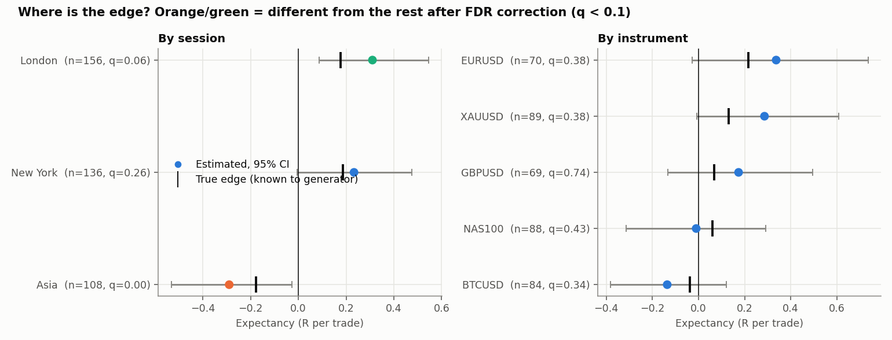
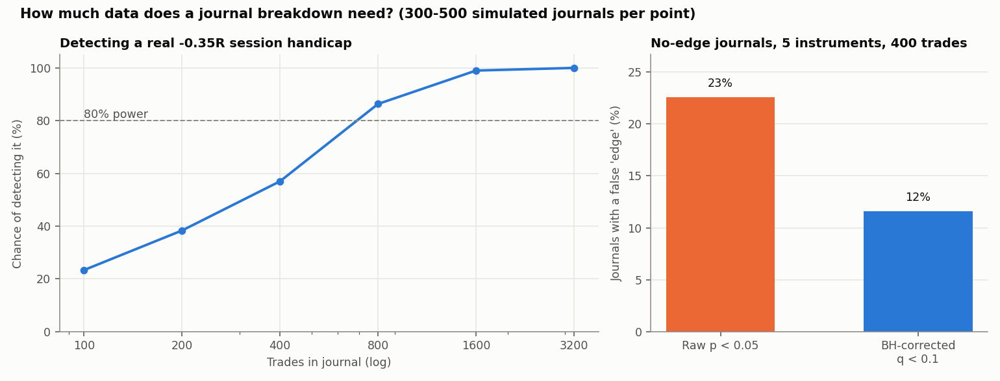
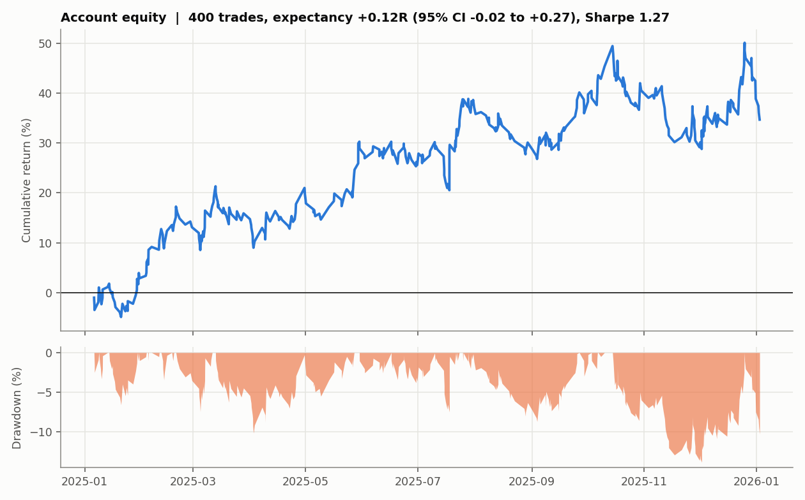
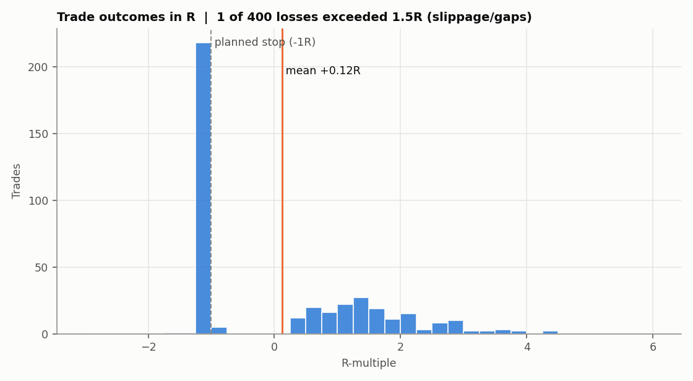

# Trade Journal Analytics: Finding Edges That Are Real

Turns a trade journal into performance metrics with **uncertainty attached**:
bootstrap confidence intervals, permutation tests of each session and
instrument against the rest, and false-discovery-rate correction. It reads
MetaTrader 5 exports directly, or any CSV with a column mapping.

## Why the statistics matter

Split 400 trades into 5 instruments and 3 sessions and some bucket will
always look best or worst by luck. The useful question is not "which
bucket has the highest average R" but "which differences are bigger than
noise, and how many trades do I need to tell?"

## Results on the bundled journal

The bundled journal is synthetic (`src/generate_trade_log.py`). Because
its true edges are known, the analysis can be scored against the truth,
which is impossible with real data. Losses cluster at −1R with slippage
and occasional gaps. The session is derived from the entry timestamp.

```
expectancy +0.122R  (95% CI -0.015 to +0.266, t = 1.68)
Sharpe (all business days) 1.27  (95% CI -0.62 to 3.14)
return 34.7%, max drawdown -13.8%, longest losing streak 9
```

Even a +0.12R edge over 400 trades is not statistically distinguishable
from zero, and the Sharpe ratio interval spans −0.6 to 3.1.



| Session | Trades | Expectancy | 95% CI | q-value | Verdict |
|---|---:|---:|---|---:|---|
| London | 156 | +0.31R | +0.09 to +0.55 | 0.06 | stronger than rest |
| New York | 136 | +0.23R | −0.01 to +0.48 | 0.27 | not distinguishable |
| Asia | 108 | −0.29R | −0.53 to −0.03 | 0.002 | **weaker than rest** |

- **Asia** has a real handicap in the generator, and the analysis finds it.
- **By instrument**, EURUSD looks best (+0.34R) and BTCUSD worst (−0.14R),
  but no instrument is distinguishable from the rest after correction.
  The black ticks show the true edges; every confidence interval covers
  its true value. With about 80 trades per instrument, a gap of this size
  should not be acted on.

## How much data a breakdown needs



- **Power.** A real −0.35R session handicap is detected by only 57% of
  400-trade journals and needs about 800 trades for 80% power
  (300 simulated journals per point).
- **False discoveries.** In journals with no edge anywhere, raw p < 0.05
  flags at least one of 5 instruments as "significantly different" 23% of
  the time. Benjamini-Hochberg correction brings that to 12%.

## Other checks in the report

- **Sharpe on every business day.** Days without trades count as zero
  return; computing it only on trading days overstates it.
- **Stop discipline.** Counts trades worse than −1.5R (slippage, gaps,
  moved stops).
- **Longest losing streak.** Useful for sizing (see project 3).




## Using a real journal

```bash
python src/analyze.py my_journal.csv                        # standard columns
python src/analyze.py mt5_positions.csv --mt5 --balance 100000 --utc-offset 2
```

- **Standard schema:** `entry_time, instrument, r_multiple`, plus optional
  `pnl_pct` or `risk_pct`, and `session`.
- **MT5 "Positions" export:** R is derived from the stop-loss distance;
  commission and swap are included in P&L. Trades without a stop get no R
  and are reported, not guessed.
- **Other formats:** `load_journal(path, mapping={"Open time": "entry_time", ...})`.

## Validation (`tests/test_journal.py`, 10 tests)

- **MT5 parser** checked on a fixture: R from the stop, a short trade, a
  missing stop, instrument clean-up, session derivation.
- **Data checks:** column-mapping validation, session boundaries, and
  generator calibration (mean R within 0.01 of the target edge).
- **Statistics:** bootstrap CI coverage within 88–99% for a 95% interval;
  permutation test false-positive rate around 5% under the null;
  Benjamini-Hochberg against hand-computed values.
- **Sharpe** includes flat days.

## Layout

```
src/loader.py              standard / MT5 / mapped CSV -> one schema, session from timestamp
src/analyze.py             metrics, bootstrap CIs, permutation tests, BH correction, CLI
src/power.py               power and false-discovery simulations
src/generate_trade_log.py  synthetic journal with known edges (edge_scale=0 -> no edge)
src/generate_plots.py
```

## Limits

- The permutation test treats trades as independent. Clustered trades
  on the same day or news event reduce the effective sample size further.
- Bucket-vs-rest tests answer "is this bucket different", not "is this
  bucket profitable". Both are shown (the CI and the q-value).
