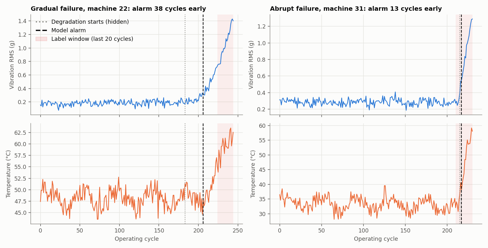
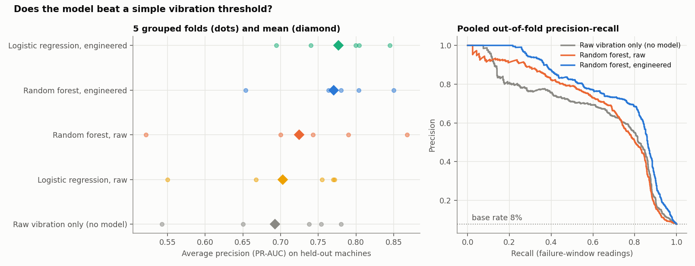
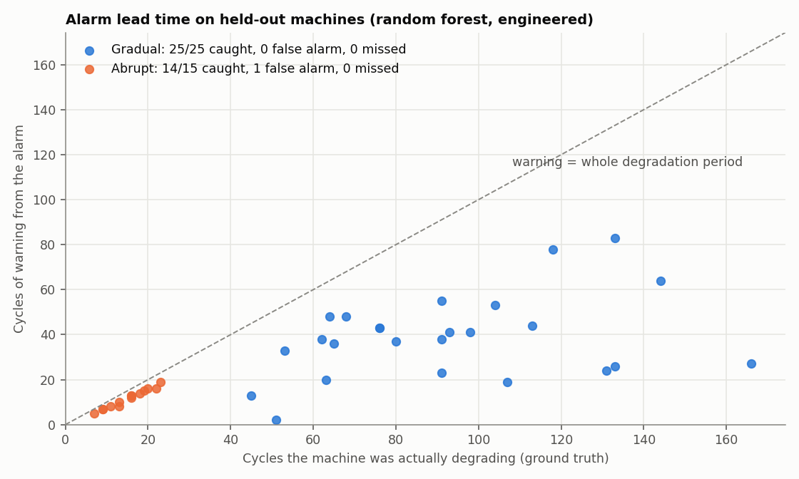
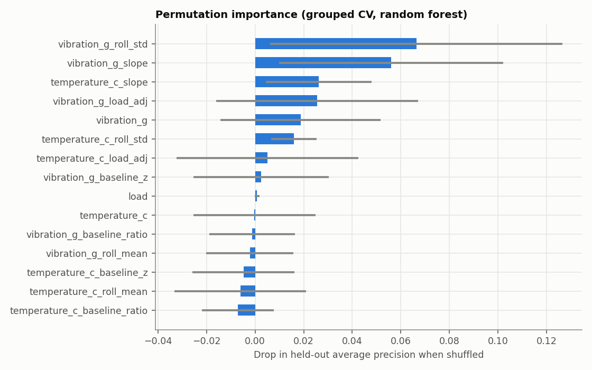

# Predictive Maintenance: ESP32 Vibration Node + Failure-Warning Model

End to end: firmware that turns a 1 kHz accelerometer burst into
vibration features and publishes them over MQTT; causal feature
engineering; model comparison against a no-model baseline under
machine-grouped cross-validation; and machine-level alarm evaluation
(caught, missed, false alarm, and how much warning).

## The data problem

The fleet is simulated (40 machines, 10,833 readings), but built so that
"high vibration means failing" is only partly true:

- **Machines differ.** Healthy vibration ranges from 0.10 to 0.45 g and
  healthy temperature from 30 to 55 °C, so one machine's normal is
  another's alarm.
- **Load confounds.** Operating load varies and raises both vibration and
  temperature.
- **Two failure modes.** Gradual wear (25 machines) starts at 50–75% of
  life. Abrupt faults (15 machines) give only 8–25 cycles of degradation.
- **Sensor imperfections.** Noise, slow sensor drift, and 2% missing
  readings (dropped packets).

The label is "fails within 20 cycles" (7.8% of readings). The hidden
degradation state is kept only to score alarms, never as a feature.



## Evaluation design

- **Grouped cross-validation.** 5 folds split by `machine_id`, so test
  machines are never seen in training, and results are averaged over
  folds rather than one lucky split.
- **Causal features.** Everything at cycle t uses only readings at or
  before t (tested). The load correction is fitted on training machines only.
- **Nested threshold tuning.** The alarm threshold is tuned on
  out-of-fold predictions within the training machines, minimising
  10 × missed failures + 3 × false alarms.
- **Alarm rule.** An alarm fires after 2 consecutive readings above the
  threshold. Each test machine is then scored:
  - **caught:** first alarm while degrading, at least 2 cycles before failure
  - **false alarm:** first alarm while still healthy
  - **missed:** no alarm, or too late to act

## Results



| Model | ROC-AUC | PR-AUC (avg precision) | Machines caught | False alarms |
|---|---:|---:|---:|---:|
| Raw vibration only (no model) | 0.911 ± 0.051 | 0.693 ± 0.097 | 39/40 | 1 |
| Logistic regression, raw | 0.912 ± 0.050 | 0.703 ± 0.096 | 40/40 | 0 |
| Random forest, raw | 0.911 ± 0.053 | 0.724 ± 0.129 | 39/40 | 1 |
| Logistic regression, engineered | 0.927 ± 0.040 | **0.777 ± 0.059** | 39/40 | 1 |
| Random forest, engineered | **0.943 ± 0.028** | 0.770 ± 0.073 | 39/40 | 1 |

(± is the standard deviation across the 5 folds.)

**What this shows:**

1. **Features matter more than the model.** Adding the engineered
   features (rolling statistics, load correction, per-machine baseline)
   raises PR-AUC by about 0.08 over raw sensors: fewer false positives
   at the same recall. Swapping logistic regression for a random forest
   on the same inputs changes little.
2. **At the machine level, a tuned vibration threshold is already very
   good.** Every approach catches 39–40 of 40 failures with at most one
   false alarm. With 40 machines, one machine is 2.5%, so the machine-level
   differences between models are within noise. On this data, the case
   for the model rests on reading-level precision, not on catching more
   failures.
3. **Warning time is limited by physics, not the model.** Median warning
   is 38 cycles for gradual wear and 13 for abrupt faults, whose
   degradation only lasts 8–25 cycles:



4. **The trend features carry the signal.** Rolling spread and slope of
   vibration matter most. Several features are strongly correlated (e.g.
   the rolling mean and the baseline ratio), and permutation importance
   splits credit between correlated features, so a near-zero bar means
   "redundant given the others", not "useless". Error bars are the
   standard deviation across folds:



Full tables are in `results/`: `model_summary.csv`, `fold_metrics.csv`,
`machine_outcomes.csv` and `permutation_importance.csv`.

## Firmware (`firmware/sensor_stream.ino`)

Every 5 seconds, the ESP32 + MPU6050 node:

1. captures 1,024 samples at about 1 kHz (400 kHz I²C; the 260 Hz digital
   low-pass is the anti-aliasing filter);
2. removes each axis's mean, which strips gravity and makes the node
   orientation-independent;
3. computes vibration RMS, peak, crest factor and kurtosis of the AC
   signal (crest factor and kurtosis react to impulsive bearing damage
   before RMS moves);
4. reads a DS18B20 without blocking, rejecting the −127 °C disconnect value;
5. publishes JSON over MQTT with a sequence number, reconnecting to Wi-Fi
   and MQTT without ever blocking the sampling loop.

`src/vibration_features.py` mirrors the firmware maths so it can be unit-tested:

- a pure sine gives RMS = A/√2, crest factor √2 and kurtosis 1.5;
- gravity orientation does not change the result;
- periodic impulses raise crest factor and kurtosis by more than 50%
  while RMS moves less than 20%.

A 1 kHz MEMS accelerometer sees shaft-rate faults and low harmonics.
Bearing defect frequencies in the kHz range need a higher-bandwidth
sensor.

## Validation (`tests/test_maintenance.py`, 9 tests)

- **Firmware maths:** sine RMS, crest factor and kurtosis; orientation
  invariance; impulse sensitivity.
- **Labels and features:** label construction and ground truth; features
  are causal (featurising a truncated history gives identical values);
  no missing values after featurisation.
- **Evaluation logic:** alarm-outcome logic on hand-built cases (caught,
  false alarm, never 2 in a row, too late); threshold selection.
- **Grouped CV:** folds never share a machine, and every machine is scored
  exactly once per model.

## Run

```bash
pip install -r requirements.txt
python src/simulate_sensor_data.py   # data/sensor_log.csv
python src/train_model.py            # comparison table (~2 min)
python src/generate_plots.py         # results/ and plots/
pytest -q
```

## Limits and next steps

- **Simulated fleet.** The obvious next step is NASA's C-MAPSS turbofan
  data or the IMS/PRONOSTIA bearing datasets, which have the same
  run-to-failure structure; `features.py` and `train_model.py` only need
  `machine_id, cycle` and sensor columns.
- **Firmware not flashed here.** The firmware is written against the
  Adafruit MPU6050, DallasTemperature and PubSubClient APIs but has not
  been run on hardware in this repository.
- **Two sensors only.** Spectral (FFT band energy) features from the
  burst would be the next feature set.
