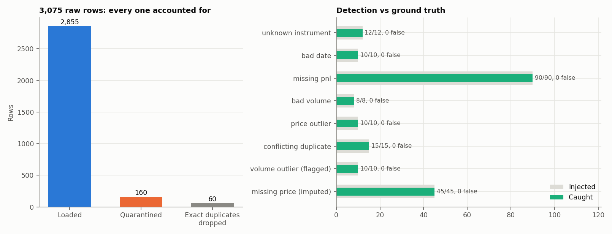

# Trade Data ETL Pipeline and Dashboard

Takes a messy trade export from three upstream systems, validates and
cleans it with **no silent drops**, loads it into a SQLite warehouse with
a primary key, a quarantine table and a run log, and serves it through a
Streamlit dashboard that shows data quality next to the numbers.

## What makes the raw file messy

`src/generate_raw_data.py` builds 3,000 trades on five instruments with
realistic price levels (EURUSD around 1.08, XAUUSD around 2,300, BTCUSD
around 60,000). It then injects problems and records each one in
`raw_data/injected_issues.json`, so detection can be scored:

| Injected problem | Count |
|---|---:|
| Date formats from 3 systems: `2025-03-04`, `04/03/2025` (day-first), `03-04-2025` (month-first) | all rows |
| Instrument spelling: `" eurusd "`, `Eurusd`, `EUR/USD` | 20% of rows |
| Unknown instruments (`EURUSDX`, `TEST`, `XAGUSD`) | 12 |
| Unparseable dates (`2025-13-01`, `31/02/2025`, blank, `n/a`) | 10 |
| Missing P&L | 90 |
| Missing price | 45 |
| Zero or negative volume | 8 |
| Fat-finger volume (×1000) | 10 |
| Decimal-slip price (×10) | 10 |
| Exact re-exported duplicates | 60 |
| Amended trades: same `trade_id`, different values | 15 |

## Rules

| Check | Action | Why |
|---|---|---|
| Required columns | fail the run | a schema change upstream should stop the pipeline, not half-load |
| Date | explicit format per source system, chosen by separator | never guess `04/03` vs `03/04` |
| Instrument | normalise case, spaces and `/`, then check the reference list | cosmetic issues fixed, genuinely unknown symbols rejected |
| Volume ≤ 0, missing P&L | quarantine | a P&L figure is never imputed |
| Price > 20% from the instrument's ±5-day median | quarantine | robust even on days with one trade |
| Missing price | impute the ±5-day median, set `price_imputed = 1` | kept for activity reporting, filterable in the dashboard |
| Volume robust z-score > 5 (log scale, MAD) | keep, set `volume_outlier_flag = 1` | a large trade may be real; the analyst decides |
| Exact duplicate | keep one, count the rest | re-exports carry no new information |
| Same `trade_id`, different values | quarantine all versions | cannot know which version is correct |

Every row is accounted for, and the run fails if it isn't:

```
rows_in (3,075) = loaded (2,855) + quarantined (160) + exact duplicates dropped (60)
```

## Detection against ground truth



All 8 injected problem types are caught completely (200 of 200 problem
rows), with **zero false flags**. The first version of the price check
used a same-day median and missed one decimal slip while wrongly
flagging two good trades on thinly traded days; the ±5-day reference
fixed both.

## Warehouse

```
trades          trade_id PRIMARY KEY, CHECK constraints on side / volume / price,
                price_imputed, volume_outlier_flag, load_run_id
quarantine      raw values as received + reason code + run_id
etl_runs        run_id, timestamp, source file name, SHA-256 of the source, JSON report
daily_activity  view: trades, volume, P&L and outliers per day and instrument
```

A load replaces `trades` and `quarantine` in one transaction, so re-running
on the same file gives an identical table (tested) and appends to
`etl_runs`.

## Dashboard (`src/dashboard.py`)

- **Filters:** instrument, date range, exclude volume outliers, exclude
  imputed prices.
- **KPIs:** trade count, total P&L, average P&L per trade, win rate.
- **Performance tab:** cumulative P&L by instrument, notional volume by
  instrument.
- **Data-quality tab:** rows received / loaded / rejected, rejection
  reasons, run history with the source hash.
- **Data tab:** filtered trades with CSV download.

```bash
pip install -r requirements.txt
python src/generate_raw_data.py
python src/etl.py
streamlit run src/dashboard.py
```

## Validation (`tests/test_etl.py`, 8 tests)

- **Detection:** every injected issue is caught, with the exact set of
  trade IDs per reason and none extra.
- **Accounting:** row counts reconcile.
- **Warehouse:** re-running is idempotent, and the run log grows; the
  primary key rejects a duplicate `trade_id`; clean data has sane price
  levels, positive volume and no missing P&L.
- **Dates:** `04/03/2025` and `03-04-2025` both parse to 4 March; invalid
  dates are rejected, not coerced.
- **Schema:** a file with missing columns fails loudly.
- **Dashboard:** executes top to bottom against a test warehouse via a
  stub `streamlit` module, and its KPIs match SQL counts.

## Limits

- SQLite keeps the project zero-setup. For Postgres, swap the connection;
  the SQL is standard apart from `CREATE VIEW IF NOT EXISTS`.
- Full reload on every run. Very large sources would need incremental
  loads keyed on `trade_id` and a watermark.
- The source system is inferred from the date format. A real feed should
  carry an explicit source column.
