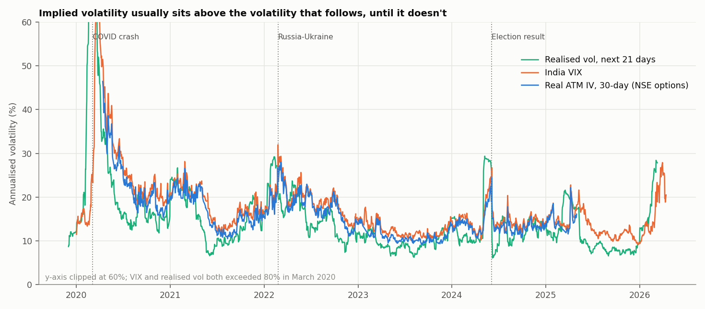
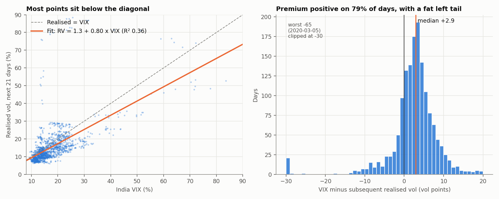
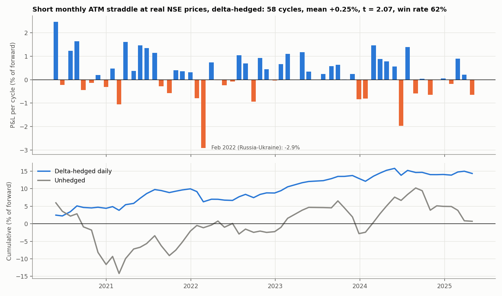
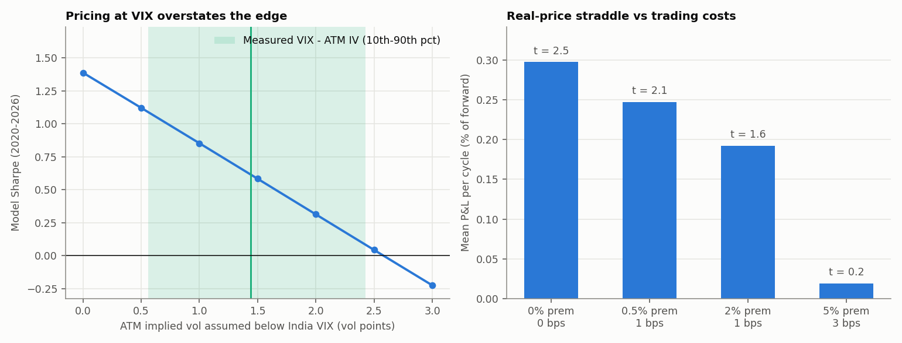

# Is NIFTY Implied Volatility Overpriced? The Variance Risk Premium in India

A study on real NSE data (2020–2026) of whether option sellers are paid
for bearing volatility risk on NIFTY, and whether a delta-hedged option
seller actually collects that premium after costs.

**Data (all real, see `data/SOURCES.md`):**
- NIFTY 50 daily closes
- India VIX
- 1,246 daily NSE F&O bhavcopy files (NIFTY monthly options and futures, April 2020 to April 2025)

## Summary

| Question | Answer |
|---|---|
| Does India VIX exceed the volatility that follows? | Yes, on **79%** of days, by **+2.2 vol points** on average (Newey-West t = 2.65) |
| Is VIX a good forecast of future volatility? | Better than trailing realised vol (R² 0.36 vs 0.26), but biased high: slope 0.80 |
| Can a straddle seller trade at VIX? | **No.** Real 30-day ATM IV is **1.44 points below VIX** on average (0.99 correlation) |
| Does a delta-hedged short straddle make money at real prices? | **Modestly:** +0.25% of notional per month, t = 2.07, 62% of months profitable, Sharpe ratio 0.94 |
| Does it survive costs? | At 2% of premium the t-stat falls to 1.6; at 5% the edge is gone |
| Unhedged? | No edge (t = 0.04); NIFTY's directional moves dominate |
| What is the risk? | Losses cluster in shocks: −2.9% (Feb 2022, Russia-Ukraine), −2.0% (June 2024 election). In the model, March 2020 costs −11% in a single month |

## 1. Implied vs realised volatility




- **Definition.** Realised vol is the annualised root-mean-square of daily log
  returns over the *next* 21 trading days, which matches the 30 calendar days
  India VIX looks ahead.
- **Why Newey-West.** The 21-day windows overlap, so consecutive days share 20
  of their 21 returns. A naive t-test on the mean premium gives t = 10.2;
  with Newey-West errors it is 2.65, still significant but 3.8× smaller
  (tested).
- **What the numbers mean.** The premium is positive most days, but its
  distribution has a fat left tail. On 5 March 2020, VIX underestimated the
  coming month's volatility by 64 points. That tail is the risk option
  sellers are paid to bear.

## 2. Real option prices: VIX is not the price you can sell at

India VIX is computed from the whole out-of-the-money option strip,
including the expensive downside puts. The ATM straddle a trader sells is
priced off ATM implied vol. From real NSE closes, `options_data.py` computes:

- the forward, from put-call parity at the strike where calls and puts are
  closest in price. It matches NIFTY futures to a **median of 1.7 bps**,
  which confirms the option data is consistent;
- ATM implied vol per expiry (Black-76), interpolated in total variance to a
  constant 30-day maturity.

Result: **VIX − ATM IV30 averages 1.44 vol points** (10th–90th percentile
0.56 to 2.43). ATM IV still exceeds subsequent realised vol by 1.8 points on
average, positive on 69% of days. The premium is real but smaller than VIX
suggests.

## 3. The trade, at real prices



**Setup** (`real_straddle.py`):

- Each month, sell the next monthly ATM straddle at the close on the day after
  the previous expiry. The strike is the traded strike nearest the forward.
- Mark it daily at real closing prices.
- Delta-hedge daily with futures (Black-76 delta at each leg's own implied vol).
- Settle at |NIFTY close − strike| on expiry day, which is NSE's final
  settlement rule.
- Costs: 0.5% of premium (spread, brokerage, STT, fees) plus 1 bp per hedge trade.

| 58 monthly cycles, May 2020 – Apr 2025 | Delta-hedged | Unhedged |
|---|---:|---:|
| Mean P&L per cycle (% of forward) | **+0.25** | +0.01 |
| t-statistic | **2.07** | 0.04 |
| Win rate | 62% | 53% |
| Worst / best cycle | −2.91 / +2.46 | −6.38 / +5.97 |
| Sharpe ratio (annualised, per unit notional) | 0.94 | 0.02 |
| Mean premium collected | 3.65% | 3.65% |
| Mean IV at entry vs realised during the cycle | 16.3 vs 14.2 | |

Hedging is what turns the premium into P&L. Unhedged, the seller is mostly
betting on direction: cycle P&L swings between −6.4% and +6.0%, and the
directional noise swamps the premium.

**Validation.** An independent Black-Scholes re-pricing of the same 58
cycles, at the same strikes, dates and implied vols, correlates **0.96**
with the real-price result.

That comparison caught a bug in the first version: near expiry the forward
was missing and the hedge froze while NIFTY fell 6% into the September 2020
expiry. Both fixes are now covered by tests.

## 4. Sensitivity, and the longer sample



**Left: the proxy matters.** A model that prices the straddle at India VIX
itself reports a Sharpe ratio of 1.39. At the measured 1.44-point gap it
drops to about 0.6, and the edge disappears once the gap exceeds about 2.5
points. Using VIX as the selling price would have overstated this trade
by more than 2×.

**Right: costs matter.** The real-price edge is significant only with tight
execution.

The model can also cover January–April 2020, which the options data does
not. Including the COVID crash lowers the Sharpe ratio to 0.62 (at the
measured gap), with a worst month of −11%. A filter that sells only when
VIX exceeds trailing realised vol does not help (Sharpe 0.48); it is
reported, not tuned away. Greeks attribution (gamma + theta + vega)
explains 90% of the variance of cycle P&L.

Full tables: `results/summary.md` and the CSVs next to it.

## Validation (`tests/test_vrp.py`, 13 tests)

- **Real data:** known NIFTY and VIX closes on event days; parity forward within
  5 bps of futures.
- **Statistics:** forward realised vol uses only future returns (no look-ahead);
  Newey-West with 0 lags equals White standard errors, and widens more than 3×
  for overlapping windows.
- **Option maths:** Black-76 put-call parity, delta against finite differences,
  implied-vol round trip; forward and ATM IV recovered from a synthetic chain;
  IV30 total-variance interpolation.
- **Straddle engines:**
  - no-move path earns exactly the premium;
  - realised = implied breaks even;
  - Greeks attribution holds;
  - the real-price engine, run on a synthetic Black-Scholes market, recovers the
    20% implied vol and profits when realised vol is 10%.

## Layout and run

```
src/data.py            NIFTY + VIX loader (bundled files or official NSE CSVs)
src/vrp.py             realised vol, VRP, Mincer-Zarnowitz with Newey-West
src/options_data.py    bhavcopy chain -> parity forward, ATM IV, 30-day IV
src/real_straddle.py   straddle backtest at real option prices
src/straddle.py        Black-Scholes model backtest (longer sample, sensitivities, attribution)
src/analysis.py        everything above -> results/summary.md
src/generate_plots.py
```

```bash
pip install -r requirements.txt
python src/analysis.py        # about 30 seconds
python src/generate_plots.py
pytest -q
```

## Limitations

- **Close-to-close only.** Daily hedging at the close; intraday hedging and
  intraday marks would change the gamma P&L.
- **Daily data.** Option closes are last-traded prices; 0.8% of marks come
  from days a leg did not trade (forward-filled).
- **Monthly options only.** Weekly options, which dominate NIFTY volume, and
  the post-2024 SEBI changes to expiries and lot sizes are not covered.
- **Margin not modelled.** Returns are per unit of notional. A short straddle
  needs roughly 10–15% of notional as margin, so the return on capital
  deployed is higher, and so is the risk.
- **Short sample.** 58 cycles and one tail event (February 2022) in the
  real-price sample. A t-stat of 2.07 is modest evidence, not proof.
