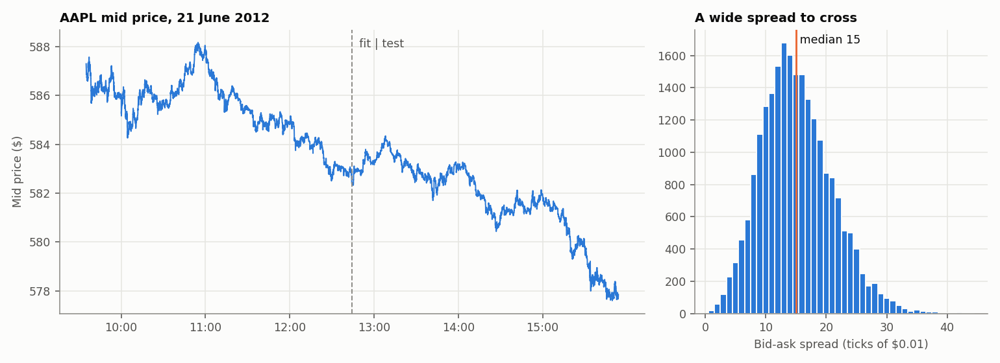
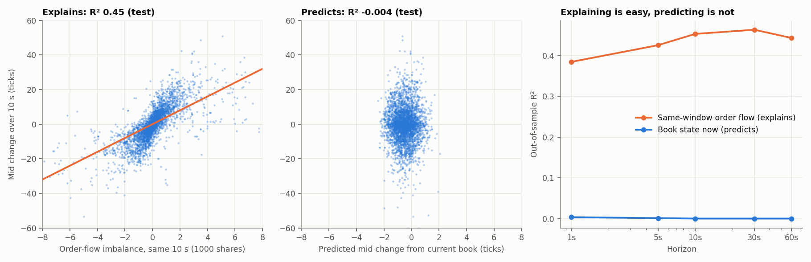
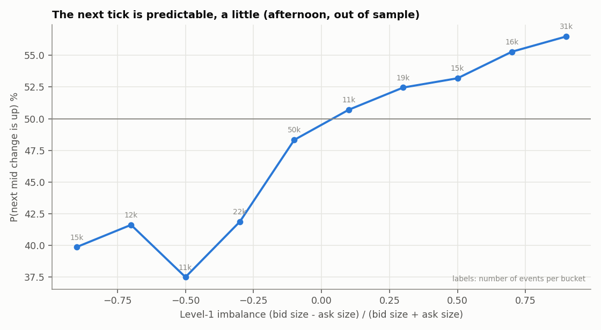
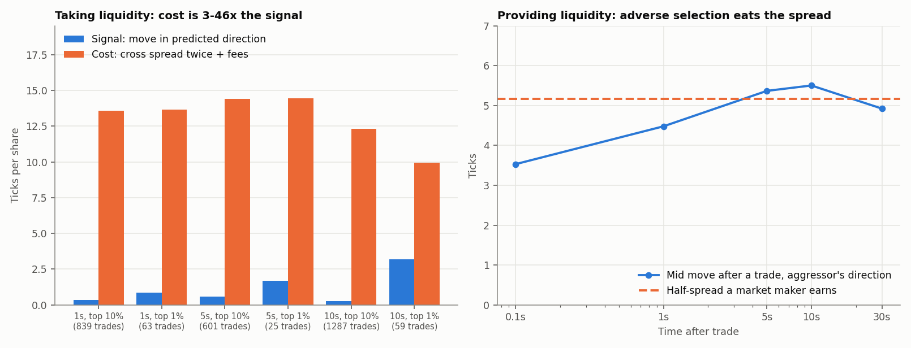

# Order-Book Imbalance: Signal, Costs and Adverse Selection

Does the state of the limit order book predict the next price move, and
can anyone make money from it once they pay to trade? A study on a full
day of real NASDAQ order-book data for AAPL: 400,391 book events,
reconstructed by LOBSTER from TotalView-ITCH.

Models are fitted on the morning and every result below is **out of
sample on the afternoon**. One stock on one day is a case study, and the
README says so wherever it matters.



## Summary

| Question | Answer (afternoon, out of sample) |
|---|---|
| Does order flow move prices? | Yes. Net order flow over a window explains **39–46%** of that window's price change (about 4 ticks per 1,000 shares) |
| Does the current book predict the next move in clock time? | Barely: R² ≈ 0 from 1 s to 60 s. The strongest 10% of signals call the 1-second direction right 61% of the time, worth 0.35 ticks |
| In event time? | Yes, modestly: P(next mid move is up) rises from 40% to 57% across imbalance buckets |
| Can a liquidity taker trade it? | No. The predictable move is 0.3–3 ticks; crossing the spread both ways costs 9–14 ticks. Net −7 to −14 ticks per share per trade |
| Can a market maker collect the spread instead? | Only just. After a trade the price moves 5.4–5.5 ticks in the aggressor's direction within 5–10 s, slightly more than the 5.2-tick half-spread earned |

## 1. Explaining vs predicting



Features (`src/features.py`), all computed from the book at or before each
time point (tested):

- **Level-1 imbalance** I1 = (bid size − ask size) / (bid size + ask size)
- **Depth imbalance** over the top 3 levels
- **Microprice offset:** the size-weighted fair price minus the mid
- **Order-flow imbalance (OFI)** of Cont, Kukanov & Stoikov (2014), summed over
  the last 10 s. It is the net size added at the best bid minus that at the
  best ask, counting queue changes, new price levels and depletions.

OFI over a window has a stable, linear relation with the price change *in
that same window*. At the 10-second horizon the slope is 4.0 ticks per 1,000
shares in the morning and 3.85 in the afternoon (4.31 vs 4.32 at 1 s), and
out-of-sample R² reaches 0.46. That is how prices form. But
the book *now* says almost nothing about the price *later*: out-of-sample
R² is 0.003 at 1 s and slightly negative beyond 10 s.

## 2. The next tick



Looked at in event time (does the next mid-price change go up or down?),
imbalance does carry information. When the bid queue dominates, the next
move is up 57% of the time; when the ask queue dominates, 40%. This is
the effect that microprice models are built on.

## 3. The economics



**Taking liquidity (left).**

- The strategy trades on the afternoon when the morning-fitted model's
  prediction is in its top 10% or top 1%.
- It buys at the ask and sells at the bid 1, 5 or 10 seconds later, paying
  about 0.3 ticks of exchange fee per side.
- Even the best case (10 s horizon, top 1% of signals) moves 3.2 ticks
  against a 9.9-tick cost. Every variant loses 7–14 ticks per share.
- AAPL in 2012 traded at about $585 with a median spread of 15 ticks, so
  the tick is small relative to the price. On large-tick stocks, where the
  spread is usually one tick, the same signal is far more valuable. That is
  the natural next test.

**Providing liquidity (right).** A market maker earns half the spread on
each fill, but trades carry information. The mid moves 3.5 ticks in the
aggressor's direction within 0.1 s and 5.5 ticks within 10 s, which exceeds
the 5.2-tick half-spread. On average, passive fills are slightly
unprofitable once the price settles. Market makers must therefore:
- use signals like the imbalance above to avoid the worst fills;
- earn exchange rebates;
- manage queue position.

## Validation (`tests/test_orderbook.py`, 10 tests)

- **Real data integrity:** 400,391 events, no crossed books, sorted levels,
  prices on the tick grid, event-type counts match the raw file.
- **Features:** OFI matches a hand calculation covering queue changes, new
  best prices and depletions; imbalance bounds; microprice stays inside the
  spread.
- **No look-ahead:** changing every event after 12:30 leaves all features
  before 12:30 unchanged. Targets are true future mid changes, and the
  next-move direction is checked on hand-built books.
- **Out-of-sample design:** the split is chronological and disjoint.
- **Economics:** the contemporaneous OFI relation holds on real data
  (positive slope, R² > 0.3); a taker pays exactly the spread plus fees;
  adverse selection has the right sign.

## Layout and run

```
src/lobster.py         LOBSTER parser + integrity checks
src/features.py        imbalance, depth imbalance, microprice, OFI; clock grid; event-time targets
src/study.py           the five analyses -> results/summary.md and CSVs
src/generate_plots.py
data/fetch_raw.sh      download the raw 110 MB files and rebuild the processed file
```

```bash
pip install -r requirements.txt
python src/study.py            # about 2 seconds
python src/generate_plots.py
pytest -q
```

To use other LOBSTER files (other stocks or days), run
`python src/lobster.py path/to/folder` and point `study.py` at the output.

## Limitations

- **One stock, one day.** AAPL on 21 June 2012 is a small-tick, wide-spread
  case; a panel of stocks and days is needed for general claims.
- **Taker only.** Execution assumes taker fills at the displayed best price.
  Passive strategies need a queue-position model, which is not built here.
- **Approximate fees.** Exchange fees and rebates are approximate
  (0.3 ticks per side).
- **Visible executions only.** Price impact is measured on visible
  executions (event type 4); hidden executions (type 5) are excluded.
